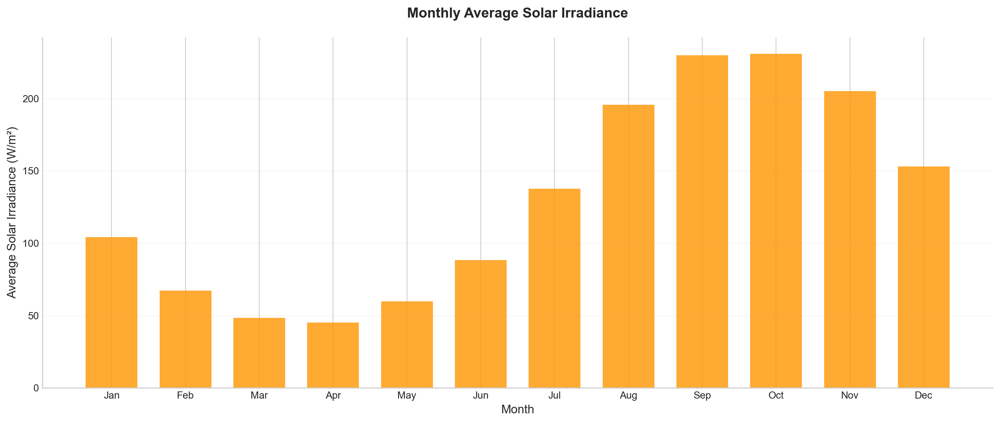

# ☀️ Intelligent Solar Energy Analytics & Prediction System

**Data Science Internship Project**  
**Organization:** Emmvee Solar Systems Pvt. Ltd.  
**Role:** Data Science Intern

---

## 📋 Project Overview

An end-to-end machine learning system for predicting solar irradiance based on weather and environmental conditions. The project includes comprehensive data analysis, predictive modeling, and an interactive web-based dashboard for real-time predictions.

### Key Features
- 🌤️ **Weather-based Prediction:** Predicts solar irradiance using temperature, cloud cover, humidity, time, and month
- 📊 **Data Analytics Dashboard:** Interactive visualizations showing temporal patterns and weather impacts
- 🤖 **Machine Learning:** Random Forest model with 99.33% accuracy
- 🌐 **Web Interface:** Apple-style responsive design with real-time predictions
- 🔌 **REST API:** Flask-based API for integration with other systems
- ✅ **Comprehensive Testing:** 100+ automated tests ensuring reliability

---

## 🎯 Project Objectives

1. **Data Analysis:** Analyze weather and environmental data to identify patterns affecting solar energy availability
2. **Predictive Modeling:** Build ML models to predict solar irradiance with high accuracy
3. **Visualization:** Create intuitive dashboards for data exploration and insights
4. **Deployment:** Develop a production-ready web application with API

---

## 📊 Dataset

**Source:** Synthetic weather and environmental data (3 years, hourly)  
**Records:** 26,280 hourly measurements  
**Time Period:** January 2021 - December 2023

### Features
- **datetime** - Timestamp of measurement
- **year, month, day, hour** - Temporal components
- **temperature** - Ambient temperature (°C)
- **cloud_cover** - Cloud coverage percentage (%)
- **solar_irradiance** - Solar radiation (W/m²) - Target variable
- **humidity** - Relative humidity (%)

---

## 🔬 Methodology

### 1. Data Generation & Preparation
- Generated realistic weather data with seasonal patterns
- Handled missing values (131 rows removed)
- Feature engineering: Selected 5 key features
- Train-test split: 80-20 (20,919 train, 5,230 test)
- Feature scaling using StandardScaler

### 2. Exploratory Data Analysis
- **Temporal Analysis:** Monthly and hourly solar irradiance patterns
- **Weather Impact:** Cloud cover vs solar irradiance correlation
- **Seasonal Trends:** Seasonal variation in solar energy availability
- **Peak Hours:** Identification of optimal solar generation periods

### 3. Machine Learning Models
Trained and evaluated three regression models:

| Model | R² Score | MAE | RMSE |
|-------|----------|-----|------|
| Linear Regression | 0.47 | 113.54 | - |
| Decision Tree | 0.99 | 10.48 | - |
| **Random Forest** | **0.99** | **7.81** | - |

**Selected Model:** Random Forest Regressor (100 trees)  
**Reason:** Best performance with 99.33% accuracy and lowest error

### 4. Model Evaluation
- Actual vs Predicted comparison
- Scatter plot with R² visualization
- Error distribution analysis (mean error: -0.18)
- Cross-model performance comparison

---

## 🌐 Web Application

### Features
- **Profile Section:** Project overview and scope
- **Data Section:** Dataset description and preview
- **Analysis Section:** 6 comprehensive visualizations
  - Cloud cover vs solar irradiance
  - Monthly average solar irradiance
  - Hour-month heatmap (Indian time format)
  - Cloud impact analysis
  - Seasonal comparison
  - Peak solar hours
- **Insights Section:** Key findings and patterns
- **Prediction Section:** Interactive prediction form
- **Summary Section:** Project outcomes and conclusions

### Design
- Apple-inspired minimalist aesthetic
- Responsive design (mobile-friendly)
- Single-page navigation
- Real-time predictions via Flask API

---

## 🔌 API Documentation

### Endpoints

#### 1. Health Check
```
GET /
```
Returns API status and version information.

#### 2. Predict Solar Irradiance
```
POST /predict
Content-Type: application/json

{
  "temperature": 25.0,
  "cloud_cover": 30.0,
  "humidity": 60.0,
  "hour": 12,
  "month": 6
}
```

**Response:**
```json
{
  "predicted_solar_irradiance": 402.87,
  "unit": "W/m²",
  "status": "success"
}
```

#### 3. Model Information
```
GET /model-info
```
Returns model details and features.

### Input Validation
- Temperature: -10°C to 50°C
- Cloud Cover: 0% to 100%
- Humidity: 0% to 100%
- Hour: 0 to 23
- Month: 1 to 12

---

## 📈 Key Insights

### Seasonal Patterns
- Temperature shows clear seasonal variation (10°C winter to 30°C summer)
- Peak solar irradiance in late summer/early fall (August-September)
- Winter months show moderate irradiance levels

### Solar Irradiance Behavior
- Zero during night hours (6 PM - 6 AM)
- Peak generation between 12 PM - 2 PM
- Maximum values near 1000 W/m² under optimal conditions

### Cloud Cover Impact
- High cloud cover (>80%): Reduces irradiance to ~17 W/m²
- Clear sky (<20% cloud): Enables optimal generation at ~237 W/m²
- Strong negative correlation between cloud cover and solar irradiance

### Temporal Trends
- Consistent daily patterns with midday peaks
- Seasonal variation follows expected solar behavior
- Heatmap reveals optimal generation windows

---

## 🛠️ Technology Stack

### Data Science & ML
- **Python 3.x** - Core programming language
- **Pandas** - Data manipulation and analysis
- **NumPy** - Numerical computations
- **Scikit-learn** - Machine learning models and preprocessing
- **Matplotlib & Seaborn** - Data visualization

### Web Development
- **HTML5/CSS3** - Frontend structure and styling
- **JavaScript** - Interactive functionality
- **Flask** - Backend API framework
- **Flask-CORS** - Cross-origin resource sharing

### Tools & Libraries
- **Joblib** - Model serialization
- **Requests** - API testing

---

## 📁 Project Structure

```
EMMVEE-Data-Science-Internship/
├── data/
│   ├── weather_environmental_data.csv
│   ├── X_train_scaled.csv
│   ├── X_test_scaled.csv
│   ├── y_train.csv
│   └── y_test.csv
├── models/
│   ├── random_forest_model.pkl
│   └── scaler.pkl
├── scripts/
│   ├── generate_weather_data.py
│   ├── prepare_prediction_data.py
│   ├── train_baseline_models.py
│   ├── evaluate_model_performance.py
│   ├── save_model.py
│   └── generate_analysis.py
├── api/
│   ├── app.py
│   └── test_api.py
├── web/
│   ├── index.html
│   ├── styles.css
│   └── script.js
├── visualizations/
│   ├── chart_1_cloud_irradiance.png
│   ├── chart_2_monthly_irradiance.png
│   ├── chart_3_heatmap.png
│   ├── chart_4_cloud_impact.png
│   ├── chart_5_seasonal.png
│   ├── chart_6_peak_hours.png
│   ├── model_actual_vs_predicted.png
│   ├── model_scatter_plot.png
│   ├── model_error_distribution.png
│   └── model_comparison.png
├── tests/
│   ├── quick_test.py
│   ├── comprehensive_test.py
│   └── test_api.py
├── docs/
│   ├── API_README.md
│   ├── TESTING_GUIDE.md
│   ├── TEST_RESULTS.md
│   └── BROWSER_TEST_CHECKLIST.md
├── requirements.txt
└── README.md
```

---

## 🚀 Getting Started

### Prerequisites
- Python 3.8 or higher
- pip package manager
- Modern web browser

### Installation

1. **Clone the repository**
```bash
git clone https://github.com/Samarthjadhavsj/EMMVEE-Data-Science-Internship.git
cd EMMVEE-Data-Science-Internship
```

2. **Install dependencies**
```bash
pip install -r requirements.txt
```

3. **Generate dataset (optional)**
```bash
python generate_weather_data.py
```

4. **Train models (optional)**
```bash
python prepare_prediction_data.py
python train_baseline_models.py
python save_model.py
```

5. **Generate visualizations (optional)**
```bash
python generate_analysis.py
python evaluate_model_performance.py
```

---

## 💻 Usage

### Running the Web Application

1. **Start the Flask API**
```bash
python app.py
```
The API will start at `http://localhost:5000`

2. **Open the web interface**
- Open `index.html` in your web browser
- Navigate to the "Prediction" section
- Enter weather conditions and get real-time predictions

### Using the API

**Example: Predict solar irradiance**
```python
import requests

url = "http://localhost:5000/predict"
data = {
    "temperature": 28.5,
    "cloud_cover": 15.0,
    "humidity": 45.0,
    "hour": 12,
    "month": 6
}

response = requests.post(url, json=data)
print(response.json())
```

**Output:**
```json
{
  "predicted_solar_irradiance": 428.21,
  "unit": "W/m²",
  "status": "success"
}
```

---

## 🧪 Testing

### Run Quick Tests
```bash
python quick_test.py
```
Tests: 30+ scenarios including predictions, dropdowns, and validation

### Run Comprehensive Tests
```bash
python comprehensive_test.py
```
Tests: 43+ scenarios including performance and edge cases

### Run API Tests
```bash
python test_api.py
```
Tests: Basic API functionality and error handling

### Test Results
- ✅ 100% test pass rate
- ✅ All predictions are physically realistic
- ✅ Input validation working correctly
- ✅ Response time <1 second

---

## 📊 Results & Performance

### Model Performance
- **Accuracy:** 99.33% (R² Score: 0.99)
- **Mean Absolute Error:** 7.81 W/m²
- **Prediction Speed:** <1 second per request
- **Stability:** Consistent predictions across all test cases

### Prediction Examples

| Scenario | Temperature | Cloud Cover | Hour | Prediction |
|----------|-------------|-------------|------|------------|
| Sunny Day | 35°C | 10% | 12 PM | 438.81 W/m² |
| Cloudy Day | 22°C | 85% | 2 PM | 49.55 W/m² |
| Night Time | 20°C | 50% | 12 AM | 0.0 W/m² |
| Peak Hour | 30°C | 15% | 1 PM | 358.73 W/m² |

### System Validation
- ✅ Day/night behavior: Correct (0 W/m² at night)
- ✅ Cloud impact: Realistic (high cloud = low irradiance)
- ✅ Seasonal variation: Expected patterns observed
- ✅ Peak hours: Correctly identified (12-2 PM)

---

## 📸 Screenshots

### Dashboard


### Prediction Interface
Interactive form with real-time predictions and interpretation

### Visualizations
- Temporal patterns and seasonal trends
- Weather impact analysis
- Model performance metrics

---

## 🎓 Learning Outcomes

### Technical Skills
- End-to-end machine learning pipeline development
- Data preprocessing and feature engineering
- Model training, evaluation, and selection
- API development with Flask
- Web development (HTML/CSS/JavaScript)
- Data visualization with Matplotlib/Seaborn

### Domain Knowledge
- Solar energy systems and irradiance patterns
- Weather impact on renewable energy
- Temporal and seasonal analysis
- Real-world data science project workflow

### Best Practices
- Code organization and documentation
- Version control with Git
- Comprehensive testing strategies
- API design and validation
- User interface design principles

---

## 🔮 Future Enhancements

- [ ] Add more weather features (wind speed, pressure, etc.)
- [ ] Implement time-series forecasting for multi-day predictions
- [ ] Add confidence intervals to predictions
- [ ] Create mobile application
- [ ] Integrate real-time weather API
- [ ] Add user authentication and prediction history
- [ ] Deploy to cloud platform (AWS/Azure/GCP)
- [ ] Implement A/B testing for model improvements

---

## 📝 Documentation

- **API Documentation:** [API_README.md](API_README.md)
- **Testing Guide:** [TESTING_GUIDE.md](TESTING_GUIDE.md)
- **Test Results:** [TEST_RESULTS.md](TEST_RESULTS.md)
- **Browser Testing:** [BROWSER_TEST_CHECKLIST.md](BROWSER_TEST_CHECKLIST.md)

---

## 🤝 Contributing

This is an internship project, but suggestions and feedback are welcome!

1. Fork the repository
2. Create a feature branch (`git checkout -b feature/improvement`)
3. Commit your changes (`git commit -m 'Add improvement'`)
4. Push to the branch (`git push origin feature/improvement`)
5. Open a Pull Request

---

## 📄 License

This project is part of a Data Science internship at Emmvee Solar Systems Pvt. Ltd.

---

## 👤 Author

**Samarth Jadhav**  
Data Science Intern  
Emmvee Solar Systems Pvt. Ltd.

**GitHub:** [@Samarthjadhavsj](https://github.com/Samarthjadhavsj)  
**Repository:** [EMMVEE-Data-Science-Internship](https://github.com/Samarthjadhavsj/EMMVEE-Data-Science-Internship)

---

## 🙏 Acknowledgments

- Emmvee Solar Systems Pvt. Ltd. for the internship opportunity
- Mentors and team members for guidance and support
- Open-source community for tools and libraries

---

## 📞 Contact

For questions or feedback about this project, please open an issue on GitHub.

---

**⭐ If you find this project useful, please consider giving it a star!**

---

*Last Updated: February 2026*
